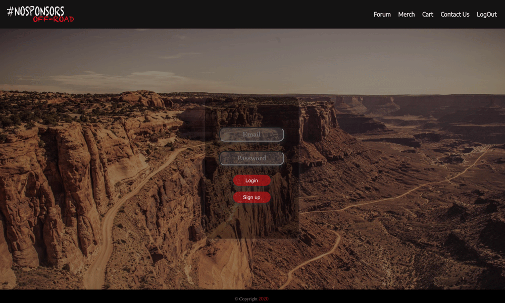
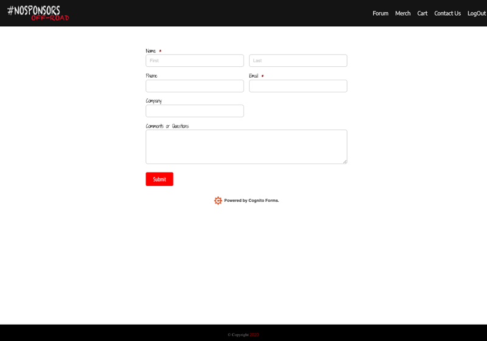

# #nosponsors off-road #

No sponsors allows car/off-road enthusiast to collaborate with vehicle builds for off-road use. It's a community where users can exchange ideas, get tips, help or resources from the community with the goal to encourange users to work on their own vehicle builds.


## Login/Register section ##

Landing page consist of an off-road terrain background with a login/register form
- Users can signin or register if they don't have an account

Demo signin 
- Email: test@email.com
- Password: t




## Forum page ##

Forum consist of the following features:
- Users can post and comment on other users post.
- Every post displays the date it was post as well as authors details
- Only users with the original post can edit/delete their own post


## Merch/Cart ##

Support the #nosponsors community with a mini store feature

- App includes a mini store where users can select add products to their cart
- Cart section allows users to delete, decrease or increase product quantity
- React Stripe is integraded for payment
- Cart is clear after check out


## Contact section ##

Questions or concerns?

- Contact form from Cognito is integrated to the app which sends messages straight to the admin email for queries. 




## App structure ##

<ul>MVP:
<li>login functionality/authentication</li>
<li>responsive design</li>
<li>redux</li>
<li>hosted site</li>
<li>redux</li>
<li>react stripe</li>
</ul>

ICEBOX
-- add store
-- scss

<br/>
*depencecies*

- axios
- react-router-dom
- redux
- react-redux
- redux-promise-middleware
- http-proxy-middleware

*routes*
- home(/)
- login --- (/loging)
- Blogs --- (/blog)
- Events --- (/events)

*file structures*
-scr/
    -App.js
    -App.css
    -index.js
    -Routes.js
    -redux/
        - store
        - reducer
    -Components/
        - Header.js
        - Home.js
        - Events.js
        - Footer.js

**Server**
<br>
- express-session
- massive
- express
- dotenv
- bcrypt

<br/>

***Endpoints***
</br>
auth:
- login => /auth/login
- register => /auth/register
- logout: => /auth/logout
- userSession: => /auth/user_session
<br/>

BlogCTRL:
- (app.get) getAllBlogs: => /api/get_blogs
- (app.post) postBlog: => /api/post_blog
- (app.delete) deleteBlog: => /api/delete_blog/:id
- (app.put) updateBlog: => /api/update_blog/:id

- (app.get) getAllEvents: => /api/get_events
- (app.post) postEvents: => /api/post_events
- (app.delete) deleteEvent: => /api/delete_event/:id
- (app.put) updateEvent: => /api/update_Event/:id

- (app.get) getAllComments: => /api/get_comments
- (app.post) postComment: => /api/post_comment
- (app.delete) deleteComment: => /api/delete_comment/:id
- (app.put) addComment: => /api/add_comment/:id


***Database***
```sql
CREATE TABLE users(
user_id SERIAL PRIMARY KEY,
username VARCHAR(20) NOT NULL,
password TEXT NOT NULL,
email VARCHAR(50) NOT NULL,
profile_pic TEXT DEFAULT ''
);
 ```

 ```sql
CREATE TABLE blogs(
blog_id SERIAL PRIMARY KEY,
blog TEXT,
user_id INT REFERENCES users(user_
 );
 ```

 ```sql
CREATE TABLE events(
event_id SERIAL PRIMARY KEY,
event TEXT,
user_id INT REFERENCES user(user_id),    
);
```

```sql
CREATE TABLE blog_comments(
commment_id SERIAL PRIMARY KEY,
comment TEXT,
user_id INT REFERENCES users(user_id),
blog_id INT REFERENCES blogs(blog_id)  
);
```

```sql
CREATE TABLE event_comments(
commment_id SERIAL PRIMARY KEY,
comment TEXT,
user_id INT REFERENCES users(user_id),
event_id INT REFERENCES events(event_id)  
);
```
